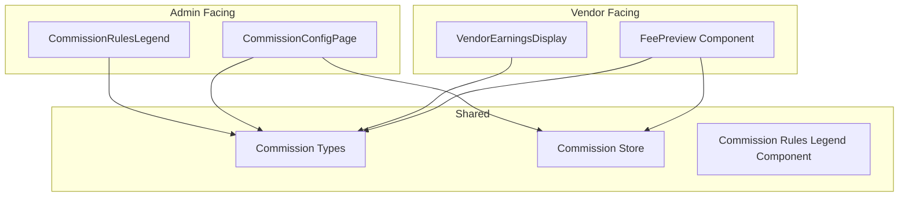

# Commission System Frontend Implementation Plan

## Overview

This document outlines the detailed implementation plan for the Commission System frontend, including all components, API types, and integration points.

## Architecture Diagram



## File Structure

```
src/
├── components/
│   └── commission/
│       ├── FeePreview.tsx
│       ├── VendorEarningsDisplay.tsx
│       └── CommissionRulesLegend.tsx
├── stores/
│   └── commissionStore.ts
├── types/
│   └── commission.ts
└── pages/
    └── admin/
        └── AdminCommissionConfigPage.tsx
```

## 1. TypeScript Types (`src/types/commission.ts`)

### Core Types

```typescript
// Commission Rule Types
export type CommissionRuleType = "STANDARD" | "FLOOR" | "CAP";

// Commission Configuration
export interface CommissionConfig {
  id: string;
  name: string;
  categorySlug: string;
  commissionRate: number; // Percentage (e.g., 8.5 for 8.5%)
  minFee: number; // Floor value in KES
  maxFee: number; // Cap value in KES
  ruleType: CommissionRuleType;
  isActive: boolean;
  createdAt: string;
  updatedAt: string;
}

// Fee Calculation Request
export interface FeeCalculationRequest {
  price: number;
  categorySlug: string;
}

// Fee Calculation Response
export interface FeeCalculationResponse {
  price: number;
  categorySlug: string;
  categoryName: string;
  baseCommission: number;
  commissionRate: number;
  minFee: number;
  maxFee: number;
  ruleType: CommissionRuleType;
  appliedFee: number;
  vatAmount: number;
  totalDeductions: number;
  vendorPayout: number;
  breakdown: {
    baseCommission: number;
    floorAdjustment?: number;
    capAdjustment?: number;
    vatAmount: number;
  };
}

// VAT Configuration
export interface VatConfig {
  rate: number; // 16 for 16%
  name: string;
}

// Commission Config List Response
export interface CommissionConfigListResponse {
  configs: CommissionConfig[];
  pagination: {
    page: number;
    limit: number;
    total: number;
    pages: number;
  };
}

// Update Commission Config Request
export interface UpdateCommissionConfigRequest {
  commissionRate?: number;
  minFee?: number;
  maxFee?: number;
  ruleType?: CommissionRuleType;
  isActive?: boolean;
}

// Commission Summary for Order
export interface OrderCommissionSummary {
  orderId: string;
  orderAmount: number;
  commissionRate: number;
  marketplaceFee: number;
  vatAmount: number;
  vendorPayout: number;
}
```

## 2. Commission Store (`src/stores/commissionStore.ts`)

### State Management

```typescript
interface CommissionState {
  // Fee Preview State
  feePreview: FeeCalculationResponse | null;
  isCalculatingFees: boolean;
  feeError: string | null;

  // Config State
  configs: CommissionConfig[];
  currentConfig: CommissionConfig | null;
  isLoadingConfigs: boolean;
  configError: string | null;

  // Actions
  calculateFees: (price: number, categorySlug: string) => Promise<void>;
  fetchConfigs: (search?: string) => Promise<void>;
  fetchConfig: (id: string) => Promise<void>;
  updateConfig: (
    id: string,
    data: UpdateCommissionConfigRequest
  ) => Promise<void>;
  clearFeePreview: () => void;
  clearError: () => void;
}
```

## 3. FeePreview Component (`src/components/commission/FeePreview.tsx`)

### Features

- **Location**: Add Product / search_and_replace Product modals in VendorCatalogPage
- **API**: GET `/api/products/calculate-fees?price=X&categorySlug=X`
- **Debounced Input**: 500ms debounce on price changes
- **Loading State**: Spinner while calculating
- **Fee Breakdown Display**:
  - Base Commission
  - Floor/Cap adjustments (if applicable)
  - VAT amount
  - Total deductions
  - Vendor payout
- **Rule Indicators**: Visual badges showing STANDARD, FLOOR, or CAP rule

### Component Props

```typescript
interface FeePreviewProps {
  price: number;
  categorySlug: string;
  categoryName?: string;
  onFeeCalculated?: (fee: FeeCalculationResponse) => void;
  showLegend?: boolean;
}
```

### UI Layout

```
┌─────────────────────────────────────────────┐
│ Fee Preview                                 │
├─────────────────────────────────────────────┤
│ ┌─────────────────────────────────────────┐ │
│ │ Marketplace Fee Breakdown               │ │
│ ├─────────────────────────────────────────┤ │
│ │ Order Amount:       KSh 10,000.00       │ │
│ │ ─────────────────────────────────────── │ │
│ │ Base Commission:    KSh 800.00 (8%)     │ │
│ │ VAT (16%):          KSh 128.00          │ │
│ │ ─────────────────────────────────────── │ │
│ │ Total Deductions:   KSh 928.00          │ │
│ │ ======================================  │ │
│ │ Your Payout:        KSh 9,072.00        │ │
│ └─────────────────────────────────────────┘ │
│ ┌─────────────────────────────────────────┐ │
│ │ [STANDARD] - Standard commission rate   │ │
│ │ Min: KSh 50 | Max: KSh 2,000            │ │
│ └─────────────────────────────────────────┘ │
└─────────────────────────────────────────────┘
```

## 4. CommissionRulesLegend Component (`src/components/commission/CommissionRulesLegend.tsx`)

### Features

- Displays rules: STANDARD, FLOOR, CAP with examples
- Can be embedded in modals or shown as tooltip

### Rule Definitions

| Rule         | Description                                                    | Example                                                        |
| ------------ | -------------------------------------------------------------- | -------------------------------------------------------------- |
| **STANDARD** | Regular percentage-based commission                            | 8% of KSh 10,000 = KSh 800                                     |
| **FLOOR**    | Minimum fee applied when calculated commission is below floor  | 8% of KSh 500 = KSh 40, but floor is KSh 50 = KSh 50           |
| **CAP**      | Maximum fee cap applied when calculated commission exceeds cap | 8% of KSh 30,000 = KSh 2,400, but cap is KSh 2,000 = KSh 2,000 |

### Component Props

```typescript
interface CommissionRulesLegendProps {
  variant?: "inline" | "card" | "tooltip";
  showExamples?: boolean;
}
```

## 5. VendorEarningsDisplay Component (`src/components/commission/VendorEarningsDisplay.tsx`)

### Features

- Shows in OrderDetailsDrawer
- Displays: Order Amount, Marketplace Fee, VAT, Vendor Payout
- Collapsible section

### Component Props

```typescript
interface VendorEarningsDisplayProps {
  orderAmount: number;
  commissionRate?: number;
  marketplaceFee: number;
  vatAmount: number;
  vendorPayout: number;
  isCollapsible?: boolean;
}
```

### UI Layout

```
┌─────────────────────────────────────────────┐
│ Earnings Breakdown                          │
├─────────────────────────────────────────────┤
│ Order Amount:           KSh 10,000.00       │
│ ─────────────────────────────────────────  │
│ Marketplace Fee (8%):   KSh 800.00          │
│ VAT (16% on fee):       KSh 128.00          │
│ ─────────────────────────────────────────  │
│ Total Deductions:       KSh 928.00          │
│ ========================================    │
│ Your Payout:            KSh 9,072.00        │
└─────────────────────────────────────────────┘
```

## 6. CommissionConfigPage (`src/pages/admin/AdminCommissionConfigPage.tsx`)

### Features

- Location: Admin Dashboard > Commission Settings
- API: GET/PUT `/api/products/commission-config/:id`
- **Editable Table**:
  - commissionRate (percentage input)
  - minFee (number input)
  - maxFee (number input)
  - validation (min < calculated < max)
  - search/filter by category
- **Admin-only access**: Check user role = SYSTEM_ADMIN

### Page Layout

```
┌─────────────────────────────────────────────────────────────────────┐
│ Commission Settings                              [Export] [Add New] │
├─────────────────────────────────────────────────────────────────────┤
│ Search: [ Category... ]                             Status: [All v] │
├─────────────────────────────────────────────────────────────────────┤
│ Category          │ Rate   │ Min Fee │ Max Fee │ Type   │ Status   │
│ ─────────────────┼────────┼─────────┼─────────┼────────┼───────── │
│ Brakes            │ 8.0%   │ KSh 50  │ KSh 2000│ STANDARD│ [Active]│
│ [Edit] [Delete]                                                       │
│ ─────────────────────────────────────────────────────────────────── │
│ Engine Parts      │ 9.0%   │ KSh 75  │ KSh 2500│ FLOOR   │ [Active]│
│ [Edit] [Delete]                                                       │
│ ─────────────────────────────────────────────────────────────────── │
│ Premium Parts     │ 10.0%  │ KSh 100 │ KSh 5000│ CAP     │ [Active]│
│ [Edit] [Delete]                                                       │
└─────────────────────────────────────────────────────────────────────┘
```

### API Endpoints

| Method | Endpoint                                              | Description                 |
| ------ | ----------------------------------------------------- | --------------------------- |
| GET    | `/api/products/commission-config`                     | List all commission configs |
| GET    | `/api/products/commission-config/:id`                 | Get single config           |
| PUT    | `/api/products/commission-config/:id`                 | Update config               |
| POST   | `/api/products/commission-config`                     | Create new config           |
| DELETE | `/api/products/commission-config/:id`                 | Delete config               |
| GET    | `/api/products/calculate-fees?price=X&categorySlug=X` | Calculate fees              |

## 7. Integration Points

### VendorCatalogPage Integration

Add FeePreview to Add/Edit Product modals:

```tsx
// In AddProductModal and EditProductModal
<div className="mt-4">
  <FeePreview
    price={formData.price}
    categorySlug={formData.category?.toLowerCase() || ""}
    categoryName={formData.category}
    showLegend={true}
  />
</div>
```

### OrderDetailsDrawer Integration

Add VendorEarningsDisplay before the Audit Trail section:

```tsx
<VendorEarningsDisplay
  orderAmount={order.total}
  marketplaceFee={calculateCommission(order.total)}
  vatAmount={calculateVAT(order.total)}
  vendorPayout={
    order.total - calculateCommission(order.total) - calculateVAT(order.total)
  }
/>
```

### Admin Menu Integration

Add to `src/layout/adminMenuConfig.tsx`:

```tsx
{
  title: "Commission Settings",
  path: "/admin/commission-config",
  icon: <SettingsIcon />,
}
```

### App Routes Integration

Add to `src/App.tsx`:

```tsx
{
  path: "admin/commission-config",
  element: <AdminCommissionConfigPage />,
}
```

## 8. Implementation Steps

### Step 1: Create TypeScript Types

- File: `src/types/commission.ts`
- Define all commission-related interfaces

### Step 2: Create Commission Store

- File: `src/stores/commissionStore.ts`
- Implement Zustand store with API calls

### Step 3: Create FeePreview Component

- File: `src/components/commission/FeePreview.tsx`
- Implement debounced fee calculation
- Add loading states
- Style breakdown display

### Step 4: Create CommissionRulesLegend Component

- File: `src/components/commission/CommissionRulesLegend.tsx`
- Define rule types with examples

### Step 5: Create VendorEarningsDisplay Component

- File: `src/components/commission/VendorEarningsDisplay.tsx`
- Implement collapsible earnings breakdown

### Step 6: Update VendorCatalogPage

- Import and add FeePreview to Add/Edit modals
- Pass price and category data

### Step 7: Update OrderDetailsDrawer

- Import and add VendorEarningsDisplay
- Calculate and pass commission data

### Step 8: Create AdminCommissionConfigPage

- File: `src/pages/admin/AdminCommissionConfigPage.tsx`
- Implement editable table with search/filter
- Add admin role check

### Step 9: Update Admin Menu

- Add Commission Settings to menu

### Step 10: Add Routes

- Add route for Commission Config page

## 9. Validation Rules

### Fee Calculation Validation

- Price must be positive
- Category must be selected
- Rate must be between 0-100%
- Min fee must be >= 0
- Max fee must be > min fee (if set)

### Config Update Validation

- Cannot set minFee > maxFee
- Cannot set rate < 0 or > 100
- Must have admin role to update

## 10. Error Handling

### Fee Calculation Errors

- Show error message if API fails
- Display "Unable to calculate fees" fallback
- Retry on network error

### Config Update Errors

- Show validation errors inline
- Display success/error toast notifications
- Revert changes on failure

## 11. Testing Checklist

- [ ] Fee calculation with various price points
- [ ] Floor rule application (low prices)
- [ ] Cap rule application (high prices)
- [ ] VAT calculation accuracy
- [ ] Admin config table editing
- [ ] Search/filter functionality
- [ ] Role-based access control
- [ ] Loading states
- [ ] Error messages
- [ ] Responsive design

## 12. Future Enhancements

- Bulk commission updates
- Category hierarchy support
- Time-based commission rules
- Vendor-specific commission rates
- Commission analytics dashboard
- Export commission reports
